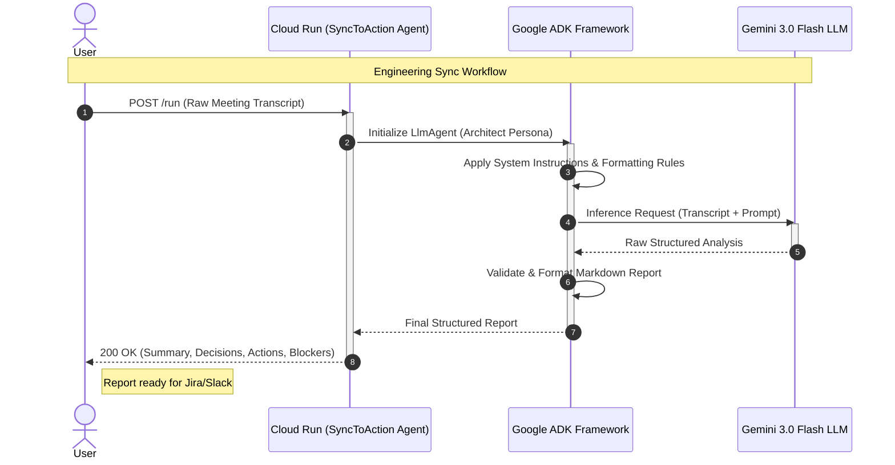

```mermaid
sequenceDiagram
    autonumber
    actor User
    participant CR as Cloud Run (SyncToAction Agent)
    participant ADK as Google ADK Framework
    participant Gemini as Gemini 3.0 Flash LLM

    Note over User, Gemini: Engineering Sync Workflow

    User->>CR: POST /run (Raw Meeting Transcript)
    activate CR
    
    CR->>ADK: Initialize LlmAgent (Architect Persona)
    activate ADK
    
    ADK->>ADK: Apply System Instructions & Formatting Rules
    
    ADK->>Gemini: Inference Request (Transcript + Prompt)
    activate Gemini
    Gemini-->>ADK: Raw Structured Analysis
    deactivate Gemini
    
    ADK->>ADK: Validate & Format Markdown Report
    
    ADK-->>CR: Final Structured Report
    deactivate ADK
    
    CR-->>User: 200 OK (Summary, Decisions, Actions, Blockers)
    deactivate CR

    Note right of User: Report ready for Jira/Slack
```